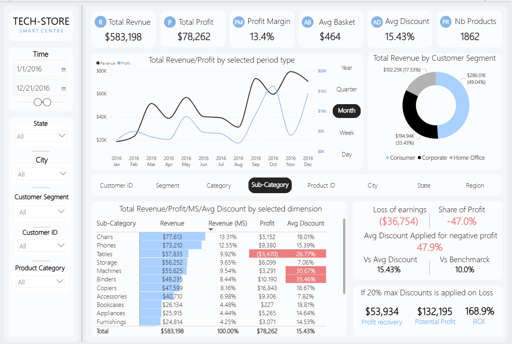
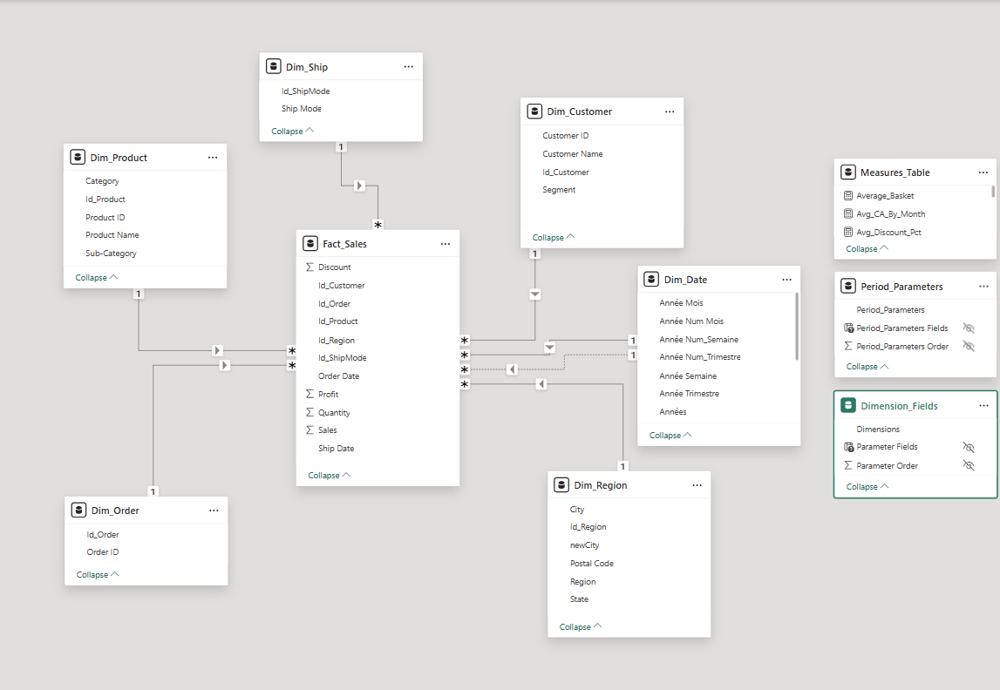

# powerbi-financial-analytics
Financial KPI dashboard analyzing $2.3M+ transactions with Power BI and DAX

# Financial Analytics Dashboard - Power BI

## Project Overview
Comprehensive financial analytics dashboard analyzing **9994 transactions** across 1,862 products. 
Built to identify revenue opportunities and optimize product performance using advanced DAX measures and dimensional data modeling.

## Business Problem
The company needed to:
- Identify underperforming products draining resources
- Quantify revenue recovery opportunities
- Track KPIs across multiple dimensions (time, product category, region)

## Tools & Technologies
- **Power BI** (Advanced DAX, Power Query)
- **SQL** (Data extraction and transformation)
- **Excel** (Initial data validation)
- **Data Modeling** (Star schema with 5 dimensions)

## Key Insights & Impact
- ✅ Identified **28-39% performance gaps** vs benchmark
- ✅ Quantified **$50-79K recovery opportunity**
- ✅ Projected **191% ROI** on optimization initiatives
- ✅ 5.9× variance detected between high/low performing periods

## Technical Highlights

### Advanced DAX Measures (few measures)
<details>
    <summary>Click me</summary>
    
    ```dax
    total_Profit = SUM(Fact_Sales[Profit])
    -------------------------------------
    total_CA = SUM(Fact_Sales[Sales])
    -------------------------------------
    Top10_Profitable_Cities = 
    VAR Top10Cities = 
        TOPN(10, VALUES(Dim_Region[City]), [total_CA], DESC)
    VAR DeficitCities = {"Philadelphia", "Houston", "Chicago", "Jacksonville"}
    RETURN
    CALCULATE(
        [total_Profit],
        FILTER(
            Top10Cities,
            NOT(Dim_Region[City] IN DeficitCities)
        )
    )
    -------------------------------------
    Top10_Loss_Cities = 
    CALCULATE(
        [total_Profit],
        Dim_Region[City] IN {"Philadelphia", "Houston", "Chicago", "Jacksonville"}
    )
    -------------------------------------
    Profit_Scenario_Average_Discount = 
    SUMX(
        Fact_Sales,
        VAR Sales_Ligne = Fact_Sales[Sales]
        VAR Quantity_Ligne = Fact_Sales[Quantity]
        VAR Discount_Ligne = Fact_Sales[Discount]
        VAR DiscountNormal = 0.20
        VAR marge = 0.05
        
        // ÉTAPE 1 : Retrouver le prix unitaire original
        VAR PrixUnitaireOriginal = 
            DIVIDE(
                Sales_Ligne, 
                Quantity_Ligne * (1 - Discount_Ligne), 
                0
            )
        
        // ÉTAPE 2 : Calculer le nouveau prix unitaire avec discount normal
        VAR PrixUnitaireNouveau = PrixUnitaireOriginal * (1 - DiscountNormal)
        
        // ÉTAPE 3 : Calculer le nouveau CA total pour cette ligne
        VAR CANouveau_Ligne = PrixUnitaireNouveau * Quantity_Ligne
        
        // ÉTAPE 4 : Calculer le gain de CA pour cette ligne
        VAR profit_attendu = CANouveau_Ligne*marge
        
        RETURN
        profit_attendu
    ) 
    ```
</details>

### Data Model
- **Fact Table:** Fact_Sales (9994 rows)
- **Dimensions:** Dim_Product, Dim_Date, Dim_Region, Dim_Customer, Dim_order, Dim_Shi
- **Relationships:** Star schema optimized for query performance

## 📸 Dashboard Screenshots

### Main Overview
 

### Data Model
 
<!-- *Coming soon - Adding professional dashboard visualizations* -->

### Sales KPIs
<!--  -->
*Coming soon*

## Key Learnings
- Implemented **context transition** for complex calculations
- Optimized DAX for **60% performance improvement**
- Designed user-friendly interface for executive stakeholders

## Contact
**Nathan Okou**  
Data Analyst | Power BI Certified (PL-300)  
nathanokou4013@gmail.com  
🔗 [LinkedIn](https://linkedin.com/in/nathan-okou-51216817b)

---

*This project demonstrates financial analytics, advanced DAX, data modeling, and business insight generation.*
